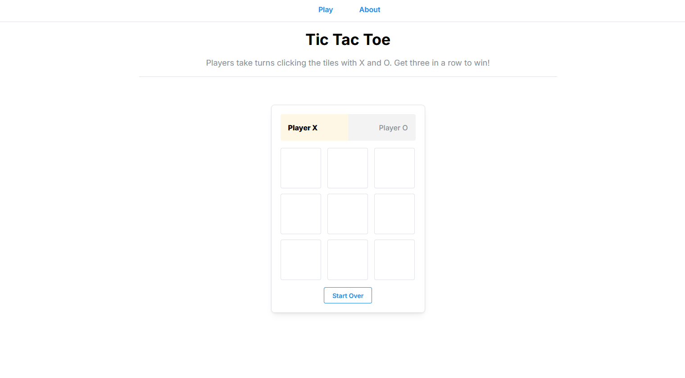

# Tic Tac Toe Game


A modern, interactive Tic Tac Toe game built for learning purposes with Next.js, TypeScript, and Mantine UI components. Features a clean, responsive design and comprehensive testing.

## Features

- **Modern UI**: Built with Mantine components
- **Theming**: Light/dark theme toggle
- **Clean design**: Game state management with React hooks
- **Comprehensive Testing**: Full test coverage with Jest using React Testing Library

## Tech Stack

- **Framework**: Next.js 15 with React 19
- **Language**: TypeScript
- **UI Library**: Mantine v8
- **Testing**: Jest + React Testing Library

## Installation

1. **Install dependencies**

   ```bash
   npm install
   # or
   yarn install
   ```

2. **Run the development server**

   ```bash
   npm run dev
   # or
   yarn dev
   ```

3. **Navigate to [http://localhost:3000]() to play**

## Available Scripts

### Development

- `npm run dev` - Start development server
- `npm run build` - Build for production
- `npm run analyze` - Analyze bundle size

### Testing

- `npm test` - Prettier, jest and lint
- `npm run jest` - Run Jest tests only
- `npm run jest:watch` - Run tests in watch mode
- `npm run typecheck` - Check TypeScript types
- `npm run lint` - Run ESLint

### Code Quality

- `npm run prettier:check` - Check code formatting
- `npm run prettier:write` - Format code with Prettier

## Project Structure

```
tictactoe/
├── app/
├── components/
│   ├── Game/
│   ├── Layout/
│   └── UI/
├── hooks/
├── tests/
│   └── integration/
├── test-utils/
└── theme.ts
```
